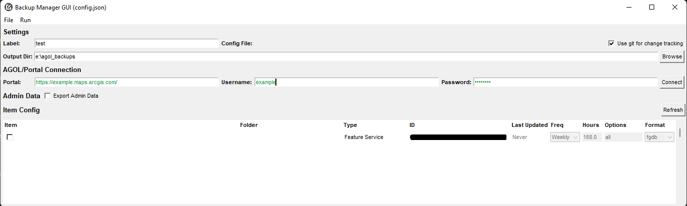

# ArcGIS Online Backup Utility

This project provides scripts and a windows exe which allows you to easily manage and schedule backups to your content on ArcGIS Online. 

***NOTE:*** This project is still in active development. The code should work but no garantees are provided.

- [ArcGIS Online Backup Utility](#arcgis-online-backup-utility)
  - [Getting Started](#getting-started)
    - [Prerequisites](#prerequisites)
    - [Installing](#installing)
      - [Setup Virtual Environment](#setup-virtual-environment)
      - [[Optional] Install ArcGIS API for Python with no dependancies.](#optional-install-arcgis-api-for-python-with-no-dependancies)
      - [Install requirements](#install-requirements)
  - [Use](#use)
    - [Setup & Scheduling](#setup--scheduling)
    - [Accessing Backups](#accessing-backups)
    - [backup_cfg_mgr.py](#backup_cfg_mgrpy)
    - [backup_mgr.py](#backup_mgrpy)
    - [backup_item.py](#backup_itempy)
    - [backup_admin.py](#backup_adminpy)
  - [Building Standalong App](#building-standalong-app)
  - [Authors](#authors)
  - [Acknoledgements](#acknoledgements)

## Getting Started

These instructions will give you a copy of the project to get it up and running on your local machine for development and testing purposes. See deployment for notes on deploying the project on a live system.

### Prerequisites

Requirements for the software and other tools to build, test and push 
- [Python 3](https://www.python.org/)
- [ArcGIS Online or Portal Account](https://www.arcgis.com/)

### Installing

A step by step series of examples that tell you how to get a development environment running. It is recomended to setup a virtual environment for running this project, especially if you plan to build it to and exe or equilivant file.

#### Setup Virtual Environment

``` Python
# Setup environment
python -m venv venv
# Activate environment
venv\Scripts\activate.bat
``` 

#### [Optional] Install ArcGIS API for Python with no dependancies.
This step can be handled by the requirements.txt file, however it will install the full ArcGIS API for Python which contains much more than is needed for this app. It is being managed manually here to reduce the size of files compiled for the window executable.

```
pip install arcgis --no-deps
```

#### Install requirements

```Cmd
# Upgrade
python -m pip install --upgrade pip 
#Install requirements
pip install -r requirements.txt
```

## Use

The project is provided as a set of python scripts. These can be built using pyinstaller (see below) but are not provided as a part of the project.

### Setup & Scheduling

To setup an environment for scheduled backups, first build a config file using backup_cfg_mgr (see below). Once setup, setup a schedule in your operating system to run the scripts according to a schedule. The schedule should be no longer than your shortest hour delay period. For example, if one of your backups are requested hourly, run your script hourly. Multiple config files can be specified and passed to backup_mgr

### Accessing Backups

Backups are committed to either a local folder or a managed local git repo. If git is enabled, using your preferred git client i.e. [Github Desktop](https://desktop.github.com/), you can access previous versions and updates to data. The script does not manage git folder size, so you will want to keep an eye on the size of your repo and perhaps clean it up periodically to flush old backups.

### backup_cfg_mgr.py

This tool manages backs up and ArcGIS Online item to a local folder including definitions, data and features in the requested format



```
optional arguments:
  -h, --help            show this help message and exit
  -c [CONFIG], --config [CONFIG]
                        Config item defining items to backup
  -v                    Verbose, also logs debug messages
  -q                    Do not log script progress to file
```

***NOTE:*** The GUI works, but is slow. It may appear to be locked up whilst connecting to an AGOL/Portal instance with a significant number of items. Patience is a virtue.

### backup_mgr.py
This tool manages backs up and ArcGIS Online item to a local folder including definitions, data and features in the requested format
```
optional arguments:
  -h, --help            show this help message and exit
  -c CONFIG [CONFIG ...], --config CONFIG [CONFIG ...]
                        Config item defining items to backup
  -v                    Verbose, also logs debug messages
  -r                    Reset items by ignoring timestamps
  -q                    Do not log script progress to file
```

### backup_item.py
This tool backs up and ArcGIS Online item to a local folder including its definition, data and features in the requested fmt
```
positional arguments:
  portal                AGOL portal
  username              AGOL username
  password              AGOL password
  itemid                AGOL item id
  outputdir             Output directory
  {csv,shp,geojson,fgdb,gpkg,kml,spkg,vtpk,xls,none}
                        fmt to export features to (if features exist)

optional arguments:
  -h, --help            show this help message and exit
  -o {item,data,metadata,thumbnail,url,sharing,appinfo,related,service,resources,comments,all} [{item,data,metadata,thumbnail,url,sharing,appinfo,related,service,resources,comments,all} ...]
                        Options for export
  -s                    Skip unmodified items (works when backing up to the same location as last time)
  -v                    Verbose, also logs debug messages
  -q                    Do not log script progress to file
```

See [Backup Items Options](backup_items_options.md) for more detail on export options.

### backup_admin.py

This tool backs up and ArcGIS Online admin item to a JSON file

```
positional arguments:
  portal                AGOL Portal
  username              AGOL Username
  password              AGOL Password
  outputdir             Output directory

optional arguments:
  -h, --help            show this help message and exit
  -c {groups,users,me,all} [{groups,users,me,all} ...], --components {groups,users,me,all} [{groups,users,me,all} ...]
                        Types to export
  -o {item,groups,usrtypes,folders,linked,items,url,thumbnail,members,all} [{item,groups,usrtypes,folders,linked,items,url,thumbnail,members,all} ...], --options {item,groups,usrtypes,folders,linked,items,url,thumbnail,members,all} [{item,groups,usrtypes,folders,linked,items,url,thumbnail,members,all} ...]
                        Types to export
  -v                    Verbose, also logs debug messages
  -q                    Do not log script progress to file
```

## Building Standalong App

To build a standalone apps, compile with pyinstaller. The below should build the four apps into executables in the 'dist' folder. These executables will work on the system upon which is was built.
```
pyinstaller --noconfirm --onefile --console --icon "img/backup_mgr.ico" --add-data "certifi;certifi"  "backup_mgr.py"
pyinstaller --noconfirm --onefile --console --icon "img/backup_item.ico" --add-data "certifi;certifi"  "backup_item.py"
pyinstaller --noconfirm --onefile --console --icon "img/backup_admin.ico" --add-data "certifi;certifi"  "backup_admin.py"
pyinstaller --noconfirm --onefile --console --icon "img/backup_cfg_mgr.ico" --add-data "certifi;certifi"  "backup_cfg_mgr.py"
```

***NOTE:*** The resulting executables are not garanteed to work within an enteprise systems. 

## Authors

 - **Paul Skeen** - *Provided main code base*
 - **Billie Thompson** - *Provided README Template*

## Acknoledgements

Inspired by the lack of a descent solution from ESRI for backing up AGOL content and the work carried out by [SEMCOG](https://github.com/SEMCOG/Ago_Backup)
